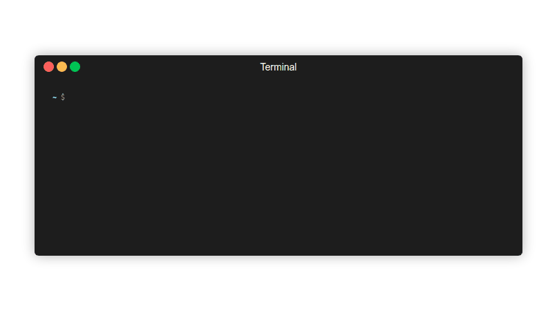

# gh-contribs

Render your contribution graph to the terminal.



connects directly via github api / no third party service is used

## Contents

## ✨ Features 

- [X] Default Style Contrast
- [X] Specify weeks
- [X] Automatic Resizing
- [X] Improved help
- [X] More control over ouput with gap arguments
- [X] Doubling █ -> ██ 
- [X] Day labels
- [X] Orientation Portrait/Landscape (NEW)

<details>
	<summary><h4>Todo</h4></summary>

- [ ] Configuration file
- [ ] Color schemes
- [ ] User defined characters(styles)
- [ ] optimize performance
- [ ] inlcude update notifier
- [ ] add version arg

</details>

## 📦 Installation
 
#### install

```
$ gh extension install mintarchit/gh-contribs
```

<details>
	<summary><h4>Manage Installation</h4></summary>

#### list installed extensions

```
$ gh extension list
```

#### upgrade

```
$ gh extensions upgrade gh-contribs
```

#### uninstall

```
$ gh extension remove gh-contribs
```
</details>

## ⚡️ Usage

```
$ gh contribs
```

#### display help with a list of all possible arguments

```
$ gh contribs --help

Usage: gh contribs [-h] [-s <style>] [-w <weeks>] [-x] [-y] [-n] [-l] [-p] [-d] [-W]

Arguments:

  -h | --help             Displays this help.
  -s | --style <style>    Change Character
  -w | --weeks <weeks>    Set range of weeks to be displayed
  -x | --xgap             Put a Gap between each Column
  -y | --ygap             Put a Gap between each Row
  -n | --no-doubles       Disable Automatic Char Doubling
  -l | --labels           Enable Labels
  -p | --portrait         Set Output Orientation
  -d | --debug            Enable additional debug output
  -W | --warning          Disable warning output

Styles:
block square dot shade fisheye diamond plus contrast

```

## Styles

- contrast (default)
- block
- square
- dot
- shade
- fisheye
- diamond
- plus

## Limitations

Resizing Terminal font-size can temporarily mess up the display of old graph outputs

## Contributing

All contributions are greatly appreciated!

If you have a suggestion that would make gh-contribs better, 
please fork the repo and create a pull request or open an issue.

See file [CONTRIBUTION.md](https://github.com/MintArchit/gh-contribs/CONTRIBUTION.md)

## Credits

gh-contribs is currently maintained by [MintArchit](https://github.com/MintArchit)

Forked from [Mizlav](https://github.com/mislav)/[gh-contrib](https://github.com/mislav/gh-contrib)

See file [CONTRIBUTORS](https://github.com/MintArchit/gh-contribs/CONTRIBUTORS)
